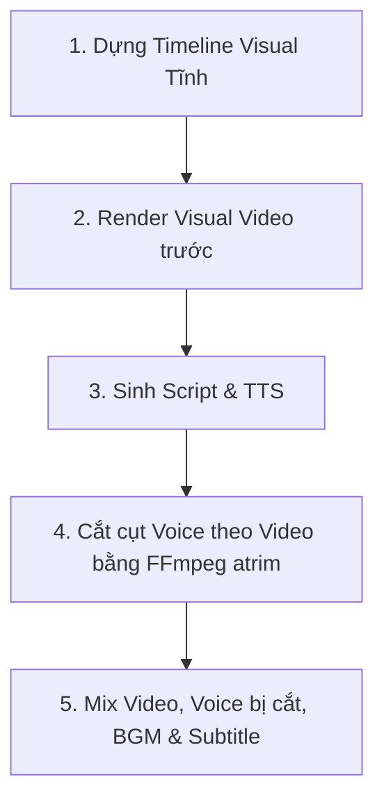
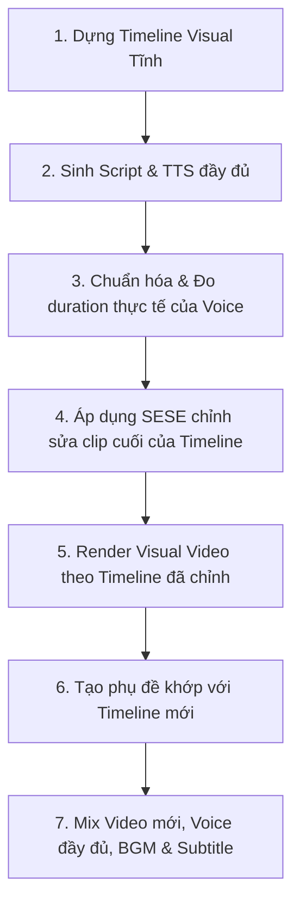

# Thiết kế Kỹ thuật: Smart Ending Synchronization Engine (SESE)

**Dự án:** Auto Tool Studio  
**Mục tiêu:** Giải quyết triệt để lỗi lệch đồng bộ âm thanh/video (`voice_longer_than_video`) mà không làm thay đổi các thành phần cốt lõi của timeline builder, segment scorer, scene allocation, hay render pipeline core.

---

## 1. So sánh Luồng Xử lý: Cũ vs Mới

### Luồng Xử lý Cũ (Old Pipeline Flow)

- **Hạn chế:** Giọng nói bị cắt cụt từ cuối câu thoại nếu thời lượng TTS thực tế dài hơn timeline visual tĩnh.

### Luồng Xử lý Mới với SESE (New SESE Pipeline Flow)

- **Ưu điểm:** Giữ nguyên 100% các phân cảnh visual trước đó, chỉ điều chỉnh/kéo dài phần cuối video để khít 100% với giọng nói thực tế.

---

## 2. Chi tiết Thuật toán SESE (SESE Engine Logic)

Sau khi có `voice_duration` (thời lượng giọng đọc thực tế) và `video_duration` (thời lượng timeline tĩnh ban đầu):
$$\Delta = \text{voice\_duration} - \text{video\_duration}$$

### Case 1: Giọng đọc dài hơn Video ($\Delta \ge 0.5$s)
Hệ thống sẽ thực hiện điều chỉnh clip cuối cùng (`last_clip = timeline.clips[-1]`) theo thứ tự ưu tiên:
1. **Giới hạn bảo vệ (Max Extension Guard):**
   Nếu $\Delta > \text{max\_auto\_extension\_seconds}$ (mặc định 8.0s), hệ thống sẽ fallback về giải pháp an toàn là **Trim Voice** (cắt âm thanh ở cuối) để tránh video bị kéo dài quá mức không mong muốn.
2. **Chiến lược 1: Kéo dài Clip cuối (Extend Last Clip):**
   - Probe thời lượng của file source video của clip cuối: `source_duration`.
   - Nếu phần video chưa dùng còn lại đủ lớn: 
     $$\text{source\_duration} - \text{last\_clip.end} \ge \Delta \times \text{last\_clip.speed}$$
     Ta cập nhật trực tiếp clip cuối:
     - `last_clip.end = last_clip.end + \Delta \times last_clip.speed`
     - `last_clip.duration = last_clip.duration + \Delta`
3. **Chiến lược 2: Đóng băng khung hình cuối (Freeze Frame):**
   - Nếu source video không đủ thời lượng để kéo dài, ta chèn thêm một clip tĩnh (`Freeze Frame`) vào cuối timeline.
   - Clip này được tạo từ khung hình cuối cùng của `last_clip` với độ dài là $\Delta$.
   - Gắn nhãn clip mới: `freeze_frame = True`, `slow_zoom = False`.
4. **Chiến lược 3: Đóng băng kèm Zoom chậm (Slow Zoom Ending):**
   - Nếu cấu hình bật `enable_end_zoom`, clip Freeze Frame ở trên sẽ được gắn nhãn: `freeze_frame = True`, `slow_zoom = True`.
   - Khi kết xuất clip này, renderer áp dụng bộ lọc `zoompan` trong FFmpeg để phóng to chậm từ 100% đến 105%.

### Case 2: Video dài hơn Giọng đọc ($\Delta \le -0.5$s)
Hệ thống **giữ nguyên timeline visual** (không cắt clip, không thay đổi scene).
- Giọng nói và phụ đề kết thúc trước một cách tự nhiên.
- Nhạc nền (BGM) tiếp tục phát và áp dụng filter `afade` tự động để nhỏ dần về cuối video.
- Hình ảnh visual và CTA Ending vẫn hiển thị trọn vẹn.

### Case 3: Chênh lệch nhỏ ($|\Delta| < 0.5$s)
Không thực hiện bất kỳ điều chỉnh nào.

---

## 3. Danh sách các File Ảnh hưởng

### Các File sửa đổi (Modified Files)
1. **[MODIFY] project_schema.py** ([backend/app/schemas/project_schema.py](file:///d:/Projects/Auto-Tool/backend/app/schemas/project_schema.py))
   - Bổ sung các cấu hình vào `RenderSettings`:
     ```python
     sese_enabled: bool = True
     sese_mode: str = "auto"  # "auto", "extend_only", "freeze_only", "zoom_only"
     max_auto_extension_seconds: float = 8.0
     ```
   - Bổ sung các trường điều khiển vào `TimelineClip`:
     ```python
     freeze_frame: bool = False
     slow_zoom: bool = False
     ```
2. **[MODIFY] timeline_builder.py** ([backend/app/modules/timeline_builder/timeline_builder.py](file:///d:/Projects/Auto-Tool/backend/app/modules/timeline_builder/timeline_builder.py))
   - Thêm `freeze_frame` và `slow_zoom` vào định nghĩa class `TimelineClip` để tránh lỗi validation extra fields (`extra="forbid"`).
3. **[MODIFY] renderer.py** ([backend/app/modules/renderer/renderer.py](file:///d:/Projects/Auto-Tool/backend/app/modules/renderer/renderer.py))
   - Cập nhật hàm `_render_clip`: Nếu clip có thuộc tính `freeze_frame=True`:
     - **Trích xuất ảnh tĩnh:** Chạy lệnh FFmpeg để trích xuất 1 khung hình tại vị trí `clip.start` từ video nguồn:
       ```bash
       ffmpeg -y -ss {clip.start} -i {source_path} -vframes 1 -q:v 2 {temp_image_path}
       ```
     - **Kết xuất Clip tĩnh:**
       - Nếu `slow_zoom=False`:
         ```bash
         ffmpeg -y -loop 1 -i {temp_image_path} -t {clip.duration} -vf "scale={width}:{height},format=yuv420p" -c:v libx264 -pix_fmt yuv420p -r {fps} -an {output_clip_path}
         ```
       - Nếu `slow_zoom=True` (Zoom chậm từ 100% đến 105%):
         ```bash
         ffmpeg -y -i {temp_image_path} -vf "zoompan=z='1.0+0.05*(on/{total_frames})':x='iw/2-(iw/zoom)/2':y='ih/2-(ih/zoom)/2':fps={fps}:d={total_frames}:s={width}x{height}" -c:v libx264 -pix_fmt yuv420p -an {output_clip_path}
         ```
         *(Trong đó $total\_frames = \text{int}(clip.duration \times fps)$)*
4. **[MODIFY] output_pipeline.py** ([backend/app/modules/render_worker/output_pipeline.py](file:///d:/Projects/Auto-Tool/backend/app/modules/render_worker/output_pipeline.py))
   - Thay đổi thứ tự kết xuất trong `render_one_output`:
     1. Sinh kịch bản (`generate_script`).
     2. Sinh giọng nói với `target_duration = 0.0` (không cắt) và đo chính xác `voice_duration`.
     3. Khởi tạo `SESEEngine` và chạy:
        ```python
        adjusted_timeline = SESEEngine.synchronize(timeline, voice_duration, config)
        ```
     4. Gọi `renderer.render_timeline` với `adjusted_timeline`.
     5. Gọi `subtitle_generator.generate_srt` với timeline phụ đề đã đồng bộ.
     6. Mix final video bằng `OverlayRenderer.render_final_video`.
5. **[MODIFY] qa_checker.py** ([backend/app/modules/qa_checker/qa_checker.py](file:///d:/Projects/Auto-Tool/backend/app/modules/qa_checker/qa_checker.py))
   - Cho phép video kết quả có độ dài thực tế lớn hơn `config.render.duration` (lên tới mức đã điều chỉnh) mà không đánh FAIL nếu SESE đã được kích hoạt và áp dụng thành công.
6. **[MODIFY] project.ts** ([frontend/src/types/project.ts](file:///d:/Projects/Auto-Tool/frontend/src/types/project.ts)) & **defaults.ts** ([frontend/src/config/defaults.ts](file:///d:/Projects/Auto-Tool/frontend/src/config/defaults.ts))
   - Đồng bộ hóa các trường cấu hình của SESE vào interface `RenderSettings` và defaults.
7. **[MODIFY] RenderSettingsPage.tsx** ([frontend/src/pages/RenderSettingsPage.tsx](file:///d:/Projects/Auto-Tool/frontend/src/pages/RenderSettingsPage.tsx))
   - Thêm checkbox `SESE Enabled`, dropdown chọn chế độ và ô nhập số giây mở rộng tối đa.

### Các File tạo mới (New Files)
1. **[NEW] sese_engine.py** ([backend/app/modules/sese/sese_engine.py](file:///d:/Projects/Auto-Tool/backend/app/modules/sese/sese_engine.py))
   - Định nghĩa lớp `SESEEngine` điều phối toàn bộ thuật toán so sánh thời lượng và chỉnh sửa timeline.
2. **[NEW] test_sese.py** ([backend/tests/test_sese.py](file:///d:/Projects/Auto-Tool/backend/tests/test_sese.py))
   - Unit tests kiểm tra các trường hợp Case 1 (kéo dài, freeze, zoom), Case 2, Case 3, và Max Guard.

---

## 4. Tác động Hệ thống & Backward Compatibility

- **Tương thích ngược (Backward Compatibility):**
  - **Hoàn toàn tương thích.** Dự án cũ không có các cấu hình SESE sẽ tự động nhận giá trị mặc định (`sese_enabled = True`, `max_auto_extension_seconds = 8.0`) thông qua cơ chế khởi tạo mặc định của Pydantic schema.
- **Yêu cầu Migration dữ liệu:**
  - **Không cần.** Do hệ thống lưu trữ JSON config trong DB, không có cột DB vật lý nào bị ảnh hưởng.
- **Thay đổi DB Schema:**
  - **Không.** Toàn bộ cấu hình mới nằm gọn trong trường JSON RenderSettings hiện có.
- **Thay đổi API:**
  - **Không.** Các API endpoint GET/POST cấu hình dự án giữ nguyên cấu trúc, chỉ tự động bổ sung/trả về các thuộc tính mới trong payload JSON.
