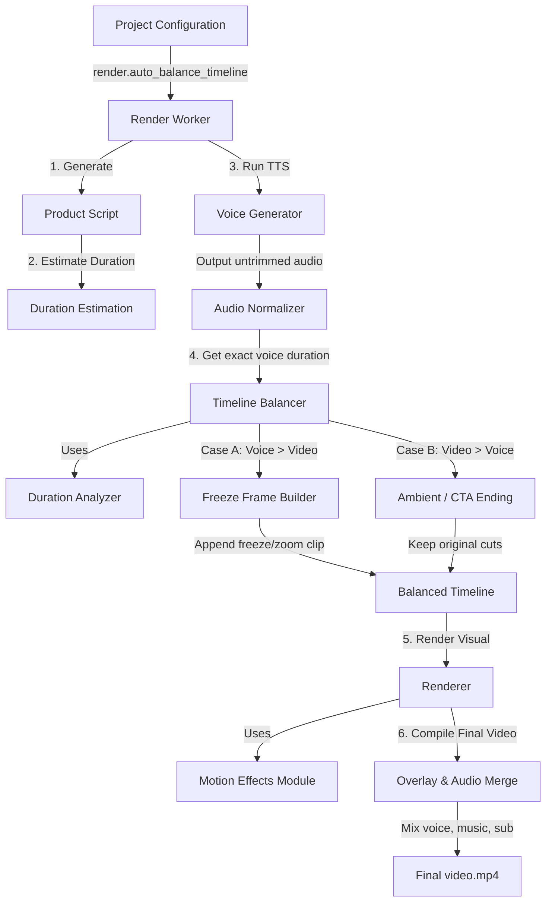

# Báo cáo Đánh giá Kiến trúc Cân bằng Âm thanh & Video (Voice Sync Architecture Review)

**Dự án:** Auto Tool Studio  
**Tác giả:** Antigravity Coding Assistant  
**Trạng thái:** Đã điều chỉnh & Sẵn sàng triển khai  

---

## 1. Các vấn đề của Kiến trúc cũ (Old Architecture Issues)

Bản thiết kế đầu tiên gặp phải một số lỗi vi phạm phân tách trách nhiệm (Separation of Concerns) và luồng xử lý chưa tối ưu:

1. **Nhập nhằng trách nhiệm Crop & Motion:** Đưa hiệu ứng Zoom/Motion (`zoompan`) vào trong `crop_strategy.py` là sai nguyên tắc. Module `crop_strategy` chỉ chịu trách nhiệm cắt ảnh, căn lề và xử lý an toàn khung hình dọc (aspect ratio), không được gánh vác các hiệu ứng camera chuyển động, hoạt ảnh hoặc phóng to thu nhỏ.
2. **Vi phạm đóng gói của VoiceGenerator:** Việc để `VoiceGenerator` tự kiểm tra biến `auto_balance_timeline` của dự án để bỏ qua việc trim voice là sai thiết kế. `VoiceGenerator` là một service độc lập chuyển đổi Text -> Audio, không được phép biết đến các khái niệm của Timeline, Render, hay chiến lược đồng bộ.
3. **Cắt xén Timeline không cần thiết (Video > Voice):** Kịch bản cũ đề xuất cắt ngắn timeline clips khi video dài hơn giọng nói. Điều này có thể phá hủy các phân cảnh cực kỳ quan trọng ở cuối video (như cảnh Kêu gọi hành động CTA, trưng bày Logo hay Cảnh cuối giới thiệu sản phẩm).
4. **Hardcode giới hạn mở rộng:** Việc cứng nhắc áp dụng giới hạn `10 giây` để tự động chuyển sang chế độ cắt thoại khiến người dùng không thể cấu hình thời lượng mở rộng tối đa theo nhu cầu sản xuất thực tế.

---

## 2. Các thay đổi đã thực hiện (Architecture Corrections)

1. **Tách biệt module Timeline Effects:** Tạo mới package `backend/app/modules/timeline_effects/` để quản lý độc lập toàn bộ các hiệu ứng chuyển động và kéo dài thời lượng video. Cô lập hoàn toàn thuật toán zoom trong `motion_effects.py` và tạo freeze-frame trong `freeze_frame_builder.py`.
2. **Làm sạch VoiceGenerator API:** Trả lại sự thuần khiết cho `VoiceGenerator`. Service này chỉ nhận `target_duration`. Nếu bộ cân bằng timeline (`TimelineBalancer`) đang bật, render pipeline (`output_pipeline.py`) sẽ chủ động truyền `target_duration = 0.0` để `VoiceGenerator` xuất file audio đầy đủ không cắt xén, sau đó mới tính toán đồng bộ.
3. **Bảo tồn Timeline gốc (Video > Voice):** Khi video gốc dài hơn giọng nói, hệ thống giữ nguyên 100% dòng thời gian gốc (không cắt, không trích xuất clip). Hệ thống chỉ áp dụng chiến lược `ambient_ending` hoặc `cta_ending` (giọng nói và phụ đề kết thúc trước, nhạc nền và các cảnh visual gốc vẫn tiếp tục trình diễn rồi tự động fade-out).
4. **Cấu hình tham số mở rộng tối đa:** Bổ sung setting `max_auto_extension_seconds` (mặc định là `8.0` giây) trong Render Settings để người dùng tự điều chỉnh ngưỡng chuyển đổi sang Voice Trim.
5. **Cải tiến cơ chế ước tính trước thời lượng (Duration Estimation):** Ứng dụng hàm `estimate_voice_duration` của `app.modules.tts.text_cleanup` để ước lượng thời lượng giọng nói ngay từ văn bản kịch bản trước khi render.

---

## 3. Sơ đồ Kiến trúc mới (Revised Architecture Diagram)

Dưới đây là sơ đồ dòng chạy dữ liệu và mối quan hệ giữa các module:

---

## 4. Danh sách các file tạo mới (New Files)

1. `backend/app/modules/timeline_effects/__init__.py`: Đăng ký module.
2. `backend/app/modules/timeline_effects/motion_effects.py`: Chịu trách nhiệm render hiệu ứng dynamic zoom (pan/slow zoom) thông qua FFmpeg filter.
3. `backend/app/modules/timeline_effects/freeze_frame_builder.py`: Chịu trách nhiệm trích xuất frame cuối và dựng TimelineClip đông cứng.
4. `backend/app/modules/timeline_balancer/__init__.py`: Đăng ký module.
5. `backend/app/modules/timeline_balancer/duration_analyzer.py`: Phân tích tỉ lệ lệch âm thanh/video.
6. `backend/app/modules/timeline_balancer/timeline_balancer.py`: Điều phối luồng cân bằng chính.
7. `backend/app/modules/timeline_balancer/sync_strategy.py`: Enum các chiến lược đồng bộ.
8. `backend/tests/test_duration_analyzer.py`: Kiểm thử bộ phân tích thời lượng.
9. `backend/tests/test_timeline_balancer.py`: Kiểm thử bộ cân bằng dòng thời gian.
10. `backend/tests/test_sync_strategy.py`: Kiểm thử các chiến lược sync.
11. `docs/TIMELINE_AUTO_BALANCER.md`: Tài liệu hướng dẫn sử dụng tính năng mới.

---

## 5. Danh sách các file sửa đổi (Modified Files)

### Backend:
1. `backend/app/schemas/project_schema.py`: Bổ sung `auto_balance_timeline`, `enable_end_zoom`, và `max_auto_extension_seconds` vào `RenderSettings`; thêm `freeze_frame` và `slow_zoom` vào `TimelineClip`.
2. `backend/app/modules/timeline_builder/timeline_builder.py`: Khai báo thêm `freeze_frame` và `slow_zoom` trong model `TimelineClip` (tránh lỗi validation extra field).
3. `backend/app/modules/renderer/renderer.py`: Import và tích hợp `apply_motion_effects` từ `timeline_effects` vào hàm `_render_clip`.
4. `backend/app/modules/render_worker/output_pipeline.py`: Thay đổi thứ tự kết xuất (Script/Voice -> Balancer -> Visual -> Sub -> Final), cập nhật schema render report và QA.
5. `backend/app/modules/qa_checker/qa_checker.py`: Nhận thêm `voice_duration` và ghi nhận cảnh báo `voice_cut_detected`.

### Frontend:
6. `frontend/src/types/project.ts`: Đồng bộ hóa kiểu dữ liệu cho `RenderSettings`, `TimelineClip` và `JobOutput`.
7. `frontend/src/config/defaults.ts`: Đặt giá trị mặc định cho cấu hình mới.
8. `frontend/src/pages/RenderSettingsPage.tsx`: Bổ sung checkbox điều khiển và giao diện hiển thị Preview Info cân bằng.
